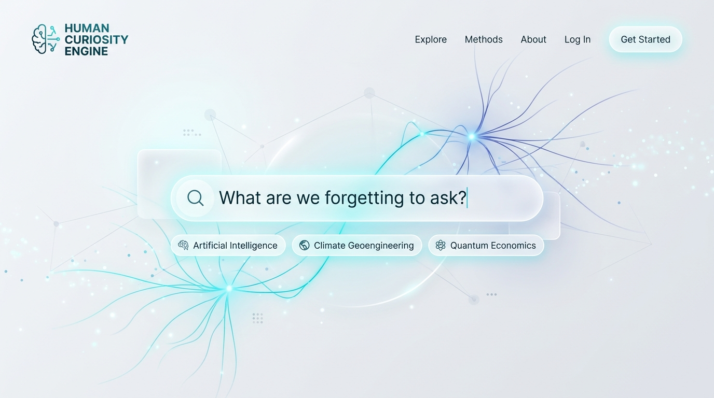
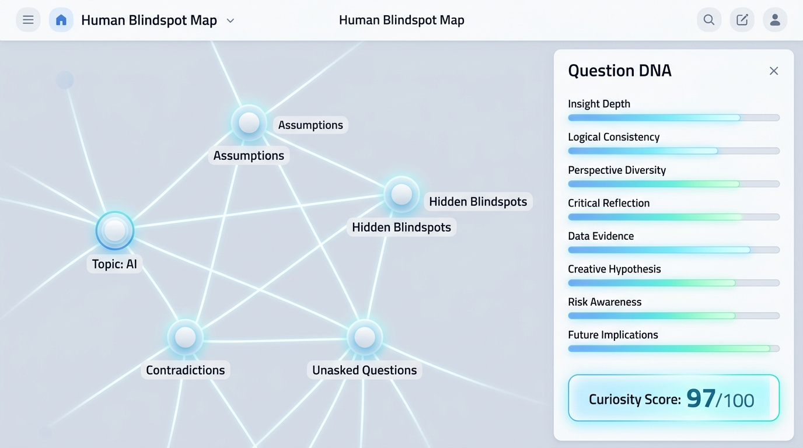
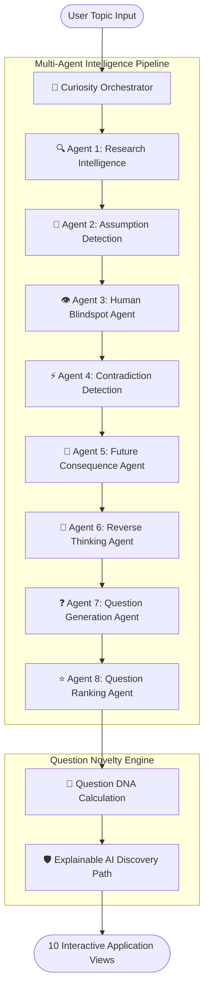
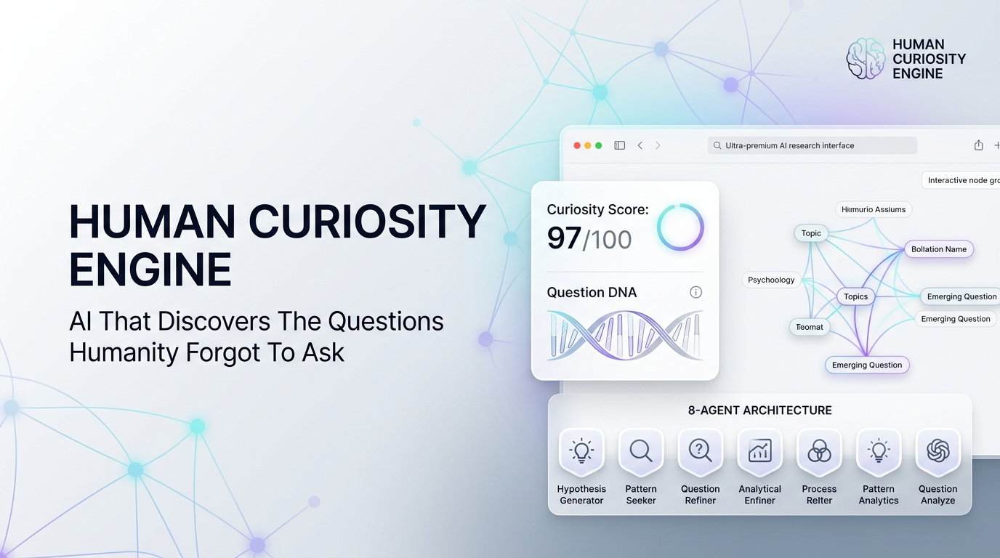

# 🧠 HUMAN CURIOSITY ENGINE

> **Tagline:** “AI that discovers the questions humanity forgot to ask.”  
> **Tamil Concept:** “மனிதர்கள் கேட்க மறந்த, ஆனால் எதிர்காலத்திற்கு முக்கியமான கேள்விகளை AI கண்டுபிடிக்கும்.”

[](https://www.typescriptlang.org/)
[](https://react.dev/)
[](https://fastapi.tiangolo.com/)
[](https://tailwindcss.com/)
[](./LICENSE)
[](https://github.com/vijaymahes9080/HUMAN-CURIOSITY-ENGINE)

<div align="center">
  
</div>

---

## 🌟 The Core Paradigm Shift

Traditional AI systems are **Answer Engines**:
```text
Human  ──►  Existing Question  ──►  AI  ──►  Answer
```

The **Human Curiosity Engine** is a **Question Discovery Platform**:
```text
Topic / System / World  ──►  8-Agent AI Analysis  ──►  Blindspots & Assumptions  ──►  Unasked Questions  ──►  Breakthrough Innovation
```

Instead of answering predefined queries, this engine interrogates reality to identify:
1. **Unexamined Baseline Assumptions** (Cultural, economic, technical dogmas)
2. **Hidden Human Blindspots** (Unmeasured metrics, invisible externalities)
3. **Systemic Contradictions & Paradoxes** (Speed vs Wisdom, Efficiency vs Fragility)
4. **Future Cascade Horizons** (2030, 2035, 2040, 2050 timeline simulations)
5. **High-Novelty Unasked Questions** with **Question DNA (0–100 Curiosity Score)**

---

<div align="center">
  
</div>

---

## 🔬 8-Agent Multi-Agent Architecture



| Agent | Responsibility | Output Structure |
|---|---|---|
| **🧠 Central Curiosity Orchestrator** | Coordinates execution DAG, resolves conflicts, eliminates semantic duplicates | Synthesized Curiosity Discovery Report |
| **🔍 Agent 1: Research Intelligence** | Indexes domain literature, maps existing consensus, flags knowledge gaps | Topic summary, established questions, knowledge gaps |
| **🧠 Agent 2: Assumption Detection** | Audits cultural, technical, economic, and social baseline dogmas | Cultural & technical axiom map |
| **👁️ Agent 3: Human Blindspot (Core)** | Pinpoints unmeasured variables, unseen dependencies, and absent stakeholders | Ignored stakeholders, unmeasured metrics, tail risks |
| **⚡ Agent 4: Contradiction Detection** | Exposes structural trade-offs and misaligned optimization targets | Logical, economic, and systemic paradoxes |
| **🔮 Agent 5: Future Consequence** | Extrapolates temporal cascade ripples across 2030, 2035, 2040, and 2050 | Scenario timeline modeling & future shock curves |
| **🔄 Agent 6: Reverse Thinking** | Inverts foundational premises, removal scenarios, and moral hazard traps | Inversion vectors & anti-fragility questions |
| **❓ Agent 7: Question Generation** | Synthesizes unasked questions across 8 categorical taxonomies | Categorized unasked question candidates |
| **⭐ Agent 8: Question Ranking** | Calculates 8-dimensional DNA vectors and composite Curiosity Scores | Ranked questions with composite scores (0–100) |

---

<div align="center">
  
</div>

---

## 📱 10 Interactive Application Views

1. **🌟 Futuristic Landing Page:** Hero section featuring *"What are we forgetting to ask?"*, prompt capsules, dynamic neural background canvas, and paradigm shift comparisons.
2. **⚡ Curiosity Discovery:** Real-time multi-agent reasoning stream with live status indicators, typewriter agent thoughts, progress meter, and audio cues.
3. **❓ Question Results:** Categorized question cards with Curiosity Score badges, category chips, DNA summaries, search, and JSON export.
4. **🔍 Question Explorer:** Comprehensive deep dive into *Why This Matters*, *Hidden Blindspot*, *Unexamined Assumptions*, *Future Impact (2030–2050)*, *Research Paper Breakthrough*, and *Startup Blueprint*.
5. **🕸️ Human Blindspot Map:** Interactive zoomable SVG node-link graph mapping Topic $\rightarrow$ Assumptions $\rightarrow$ Blindspots $\rightarrow$ Contradictions $\rightarrow$ Unasked Questions with node inspection drawer.
6. **⏳ Future Explorer (2050):** Temporal simulator for 2030, 2035, 2040, and 2050 with scenario overviews and urgent unasked questions.
7. **🔬 Research Mode:** Academic workbench comparing Crowded research vs Emerging frontiers vs Potential research blindspots + 1-click generators for Paper Concepts, Problem Statements, and Methodologies.
8. **💡 Startup Opportunity Mode:** Venture studio converting unasked questions into complete startup blueprints with Problem, Solution, Tech Stack, Market Size, Business Model, and MVP Idea.
9. **🌐 Community Universe:** Intellectual discourse salon with trending question filters, upvotes, and dialectical challenge threads.
10. **📊 Curiosity Dashboard:** Personal profile for Vijay Mahes, 4 key metric stat cards, curiosity evolution timeline, and saved bookmarks.

---

## 🧬 Question DNA & Scoring Taxonomy

Each discovered question receives an 8-dimensional scoring vector $\mathbf{v} \in [0, 100]^8$:
* **Originality ($w = 0.20$)**
* **Importance ($w = 0.20$)**
* **Future Impact ($w = 0.15$)**
* **Research Potential ($w = 0.15$)**
* **Innovation Potential ($w = 0.10$)**
* **Urgency ($w = 0.08$)**
* **Feasibility ($w = 0.05$)**
* **Human Impact ($w = 0.07$)**

$$\text{Curiosity Score} = \min\left(99, \text{round}\left(\sum_{i=1}^{8} w_i v_i + \delta(\mathbf{v})\right)\right)$$

---

## 📚 Built-in Domain Knowledge Packs

The repository includes curated high-novelty domain knowledge packs in `knowledge_bases/`:
* `ai_neuro_ethics.json`: AI & Neuro-Cognitive Ethics
* `quantum_economics.json`: Quantum Computing & Cryptographic Sovereignty
* `planetary_geoengineering.json`: Planetary Geoengineering & Aerosol Governance
* `synthetic_biology_food.json`: Synthetic Biology & Cellular Food Sovereignty
* `deep_time_longtermism.json`: Deep-Time Economics & 7-Generation Stewardship
* `autonomous_governance.json`: Autonomous Governance & Computational Constitutions
* `brain_computer_interfaces.json`: Brain-Computer Neural Interfaces & Cognitive Privacy
* `space_resource_mining.json`: Deep Space Extraction & Asteroid Commons

---

## 🚀 Quick Start & Development

### 1. Prerequisites
- **Node.js** v18+ & **npm**
- **Python** 3.10+

### 2. Frontend Setup
```bash
cd frontend
npm install
npm run dev
```
Open **[http://localhost:3000](http://localhost:3000)** in your browser.

### 3. Backend Setup
```bash
cd backend
python -m venv venv

# On Windows:
.\venv\Scripts\activate
# On Linux/macOS:
source venv/bin/activate

pip install -r requirements.txt
uvicorn backend.app.main:app --reload --port 8000
```
API Documentation will be available at **[http://localhost:8000/docs](http://localhost:8000/docs)**.

### 4. Running Tests
```bash
# Run DNA scoring tests
python -m unittest tests/test_dna_scoring.py

# Run Multi-Agent pipeline tests
python -m unittest tests/test_agents.py
```

### 5. Docker Deployment
```bash
docker-compose up --build
```

---

## 🤖 Multi-Provider AI Support

* **Curiosity Neural Mock Engine (Default):** Zero-config offline intelligence for instant multi-agent simulations across 100+ domains.
* **Google Gemini API:** Native Gemini 2.5 Flash / 1.5 Pro support.
* **OpenAI API:** GPT-4o / GPT-4o-mini support.
* **Ollama Local LLM:** Run fully offline on local GPU with Llama 3, DeepSeek, or Mistral.

---

## 👨‍💻 Developer & Author Info
* **Author:** Vijay Mahes
* **Email:** Vijaypradhap2004@gmail.com
* **Repository:** [https://github.com/vijaymahes9080/HUMAN-CURIOSITY-ENGINE](https://github.com/vijaymahes9080/HUMAN-CURIOSITY-ENGINE)

---

## 📄 License
This project is licensed under the **MIT License** — see the [LICENSE](./LICENSE) file for details.
